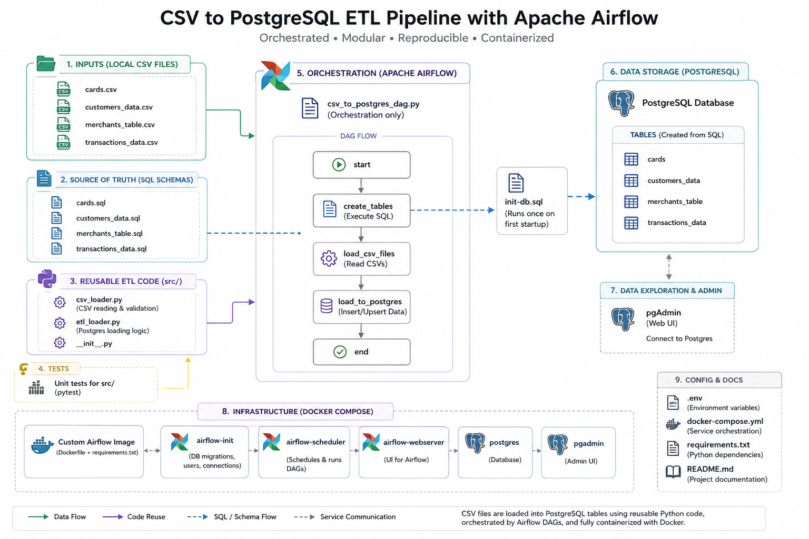
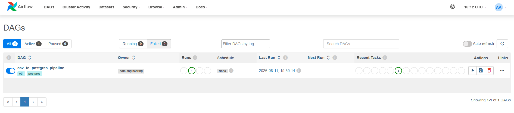
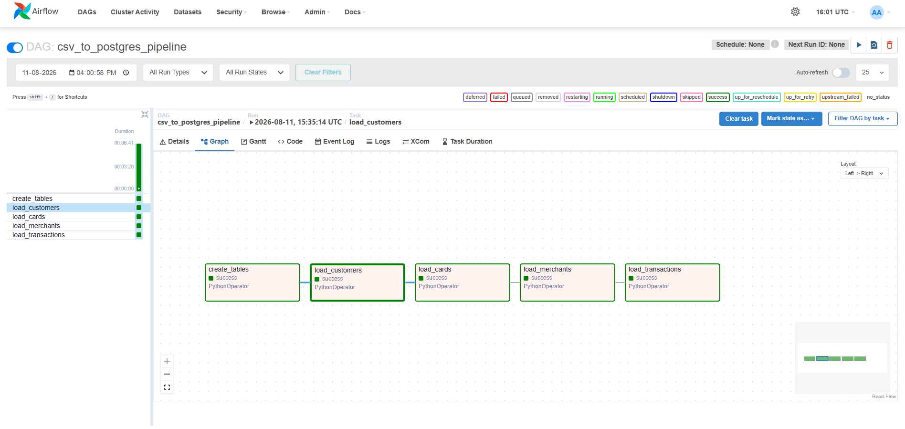
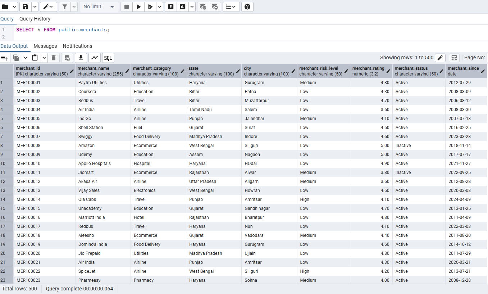
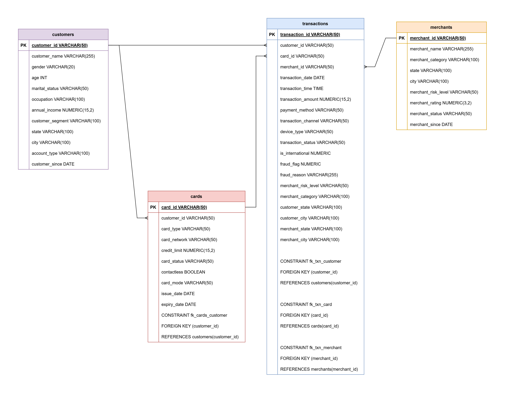

# ETL Pipeline Boilerplate

## Overview

This project demonstrates a minimal production-style Data Engineering ETL pipeline project using **Python**, **Postgres** for storage, **Apache Airflow** for orchestration, **pgAdmin** for poking around the database, small src/ package for the actual ingestion logic, and **Docker**.

The pipeline ingests multiple CSV datasets related to customers, cards, merchants, and transactions, and loads them into a PostgreSQL database through an orchestrated Airflow DAG.

---

## Architecture



## Tech Stack

* Python 3.12
* PostgreSQL 17
* Apache Airflow 2.10
* Docker
* Pandas
* SQLAlchemy
* Psycopg2

## Repo Structure

```
etl-project-boilerplate/
├── dags/                        # Airflow DAGs (orchestration only)
│   └── csv_to_postgres_dag.py
├── data/                        # Sample / local CSVs, not a data lake
│   └── cards.csv
│   └── customers_data.csv
│   └── merchants_table.csv
│   └── transactions_data.csv
├── docker/
│   ├── Dockerfile               # Custom Airflow image (base image + requirements.txt)
│   └── init-db.sql              # Postgres automatically executes them when the container starts for the first time.
├── sql/
│   └── cards.sql                # Source of truth for table definitions
│   └── customers_data.sql
│   └── merchants_table.sql
│   └── transactions_data.sql
├── src/                         # Reusable, testable Python — no Airflow imports here
│   └── __init__.py
│   └── csv_loader.py
│   └── etl_loader.py
├── tests/                       # Unit tests for src/ code
├── .env                         # Local config & credentials for docker-compose
├── .gitignore
├── docker-compose.yml           # postgres, pgadmin, airflow-init/scheduler/webserver
├── README.md
└── requirements.txt             # Installed into the custom Airflow 
```

Read the "Why it's organized this way" section below; that's the part that actually matters once you're working on a bigger codebase.

---

## DAG Workflow

The dependency chain ensures all foreign-key relationships are satisfied before transaction data is loaded.

---

## What each folder is for

- **`dags/`** — Only orchestration code: define tasks, wire up dependencies,
  set a schedule. A DAG file should be readable in ten seconds. If you find
  yourself writing `pandas` logic directly inside a DAG, that logic belongs
  in `src/` instead — it should be a one-line call from the DAG.

- **`data/`** — Small sample/local files for development and demos only.
  This is **not** where production data lives; a real pipeline reads from
  and writes to Postgres (or S3/GCS/whatever your target is), not from files
  sitting in git.

- **```docker/```** — Everything needed to build the environment: the custom
  Airflow image (`Dockerfile`) and the script Postgres runs once on first
  boot (`init-db.sql`) to create the application database.

- **`sql/`** — DDL for your tables. Keep this as the single source of truth
  for what your schema looks like, and version it like code — because it is
  code.

- **`src/`** — Framework-level, reusable Python: database connections, CSV/
  API/file loaders, transformation helpers. This code has no idea Airflow
  exists, which means you can unit test it, reuse it in a notebook, or call
  it from a plain script — `dags/` is just one consumer of it.

---

## Why it's organized this way

The core principle: **orchestration and logic are separate.** Airflow tells
your pipeline *when* and *in what order* to run; `src/` contains *what* it
actually does. This separation is what lets you:

- Unit test your ingestion code without spinning up Airflow at all.
- Swap orchestrators later (Airflow → Dagster → cron) without rewriting
  business logic.
- Reuse the same loader in a DAG, a one-off backfill script, and a notebook.

---

## Setup

### 1. Clone Repository

```bash
git clone <repository-url>

cd Data-Engineering-ETL-Boilerplate
```

### 2. Configure Environment Variables

Create a .env file in the project root if it is not already present. Need to enter the below values in the .env file:

```text
POSTGRES_USER = <your_postgres_username>
POSTGRES_PASSWORD = <your_postgres_password>
POSTGRES_HOST= <your_postgres_database_name>
POSTGRES_PORT = 5432

# Business Database
BUSINESS_DB=bankdb

# Airflow Metadata Database
AIRFLOW_DB=airflow_metadata

PGADMIN_DEFAULT_EMAIL = <your_pgadmin_email>
PGADMIN_DEFAULT_PASSWORD = <your_pgadmin_password>

AIRFLOW_UID = 50000

AIRFLOW_ADMIN_USERNAME = <your_airflow_admin_username>
AIRFLOW_ADMIN_PASSWORD = <your_airflow_admin_password>

AIRFLOW_ADMIN_EMAIL = <your_email_address>
```

---

### 3. Add the CSV Files

Place the input CSV files inside the data/ directory:
```
data/
├── cards_data.csv
├── customers_data.csv
├── merchants_table.csv
└── transaction_data.csv
```
The files are mounted into the Airflow containers at: **/opt/airflow/data**

### 4. Build and Start Services
Make sure Docker Desktop is running, then execute:
```bash
docker compose up --build -d
```
This starts the following services:
- PostgreSQL 17
- pgAdmin 4
- Airflow Init
- Airflow Scheduler
- Airflow Webserver

Check the running containers:

```bash
docker compose ps
```

The airflow-init container is expected to exit after successfully initializing the Airflow metadata database and creating the Airflow admin user.

### 5. Verify Airflow Initialization

Check the initialization logs:
```bash
docker compose logs airflow-init
```
- You should see a successful database migration and Airflow user creation.

- If the initialization was successful, the scheduler and webserver should be running.

Check the scheduler logs if required:
```bash
docker compose logs -f airflow-scheduler
```

### 6. Access Airflow
Open:
```link
http://localhost:8080
```

Log in using the credentials configured in .env:
```
Username: <AIRFLOW_ADMIN_USERNAME>
Password: <AIRFLOW_ADMIN_PASSWORD>
```
The DAG should appear in the Airflow UI



### 7. Trigger DAG

- Trigger the DAG from the Airflow UI.

- The create_tables task executes the SQL files from the sql/ directory and creates the required PostgreSQL tables

- Each CSV loading task loads its corresponding CSV file into PostgreSQL.




---

### 8. Access PostgreSQL Through pgAdmin

Open:
```link
http://localhost:5050
```
Log in using the pgAdmin credentials configured in .env.

Create/register a PostgreSQL server using:
```
Host: postgres
Port: 5432
Username: <POSTGRES_USER>
Password: <POSTGRES_PASSWORD>
```
The PostgreSQL instance contains two databases:
```
airflow_metadata
bankdb
```

**airflow_metadata** stores Airflow's internal metadata.

**bankdb** stores the project's business tables:

bankdb
└── public
    ├── customers
    ├── cards
    ├── merchants
    ├── transactions

---

### 9. Verify the Loaded Data

Run the following queries in pgAdmin:
```sql
SELECT COUNT(*) FROM customers;

SELECT COUNT(*) FROM cards;

SELECT COUNT(*) FROM merchants;

SELECT COUNT(*) FROM transactions;
```



---

### 10. Stop the Services

To stop the containers without deleting the database volumes:
```bash
docker compose down
```
The PostgreSQL and pgAdmin data will remain persisted in Docker volumes.

---

### 11. Restart the Project

To start the existing environment again:
```bash
docker compose up -d
```

---

### 12. Reset the Entire Environment

To remove the containers and all persisted PostgreSQL/pgAdmin data:
```bash
docker compose down -v
```

Then rebuild the environment:
```bash
docker compose up --build -d
```
Warning: docker compose down -v deletes the Docker volumes containing the PostgreSQL data. Use this only when you intentionally want a clean environment.

---

## Database Schema

**Tables created:**

* customers
* cards
* merchants
* transactions

**Foreign keys:**

* cards.customer_id → customers.customer_id
* transactions.customer_id → customers.customer_id
* transactions.card_id → cards.card_id
* transactions.merchant_id → merchants.merchant_id



---

## Project Highlights

* Modular ETL design
* Generic reusable CSV loader
* PostgreSQL relational model
* Airflow orchestration
* Dockerized deployment
* Production-oriented repository structure
* Scalable for additional datasets
